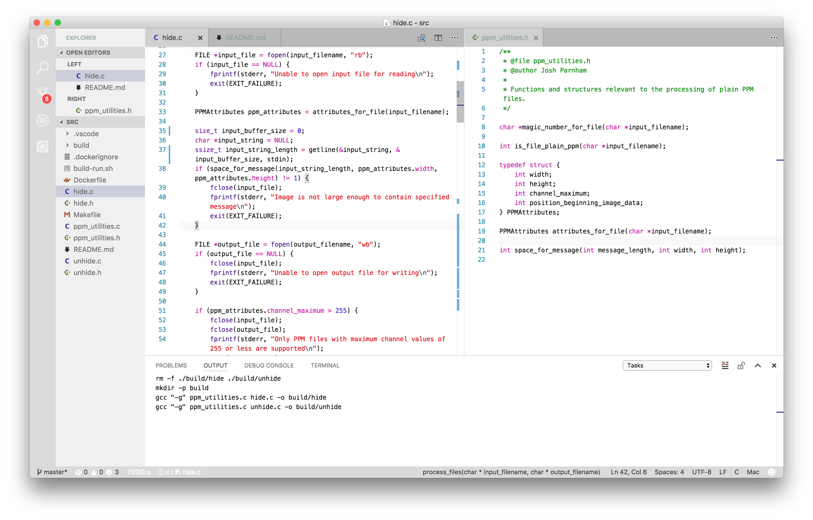

# VSCode Mac Workbench Theme

A macOS-inspired example of using the new [workbench theming](https://code.visualstudio.com/updates/v1_11#_preview-workbench-theming) support in [Version 1.11](https://code.visualstudio.com/updates/v1_11).

## Usage

Insert the contents of [`settings.json`](settings.json) into your User `settings.json`, which can be found by going to 'Preferences > Settings' or editing the file at the following paths:

- Windows: `%APPDATA%\Code\User\`
- Mac: `~/Library/Application Support/Code/User/`
- Linux: `~/.config/Code/User/settings.json`

